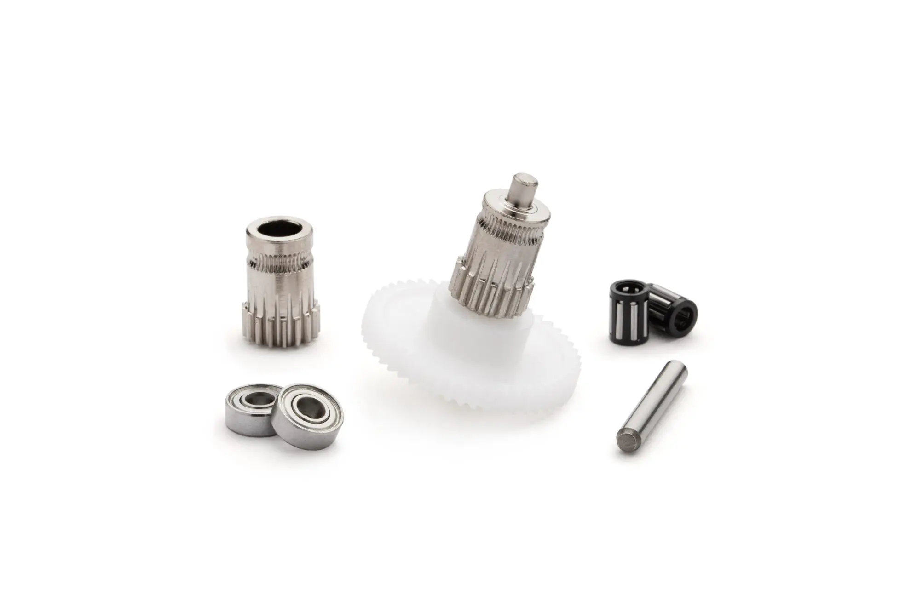
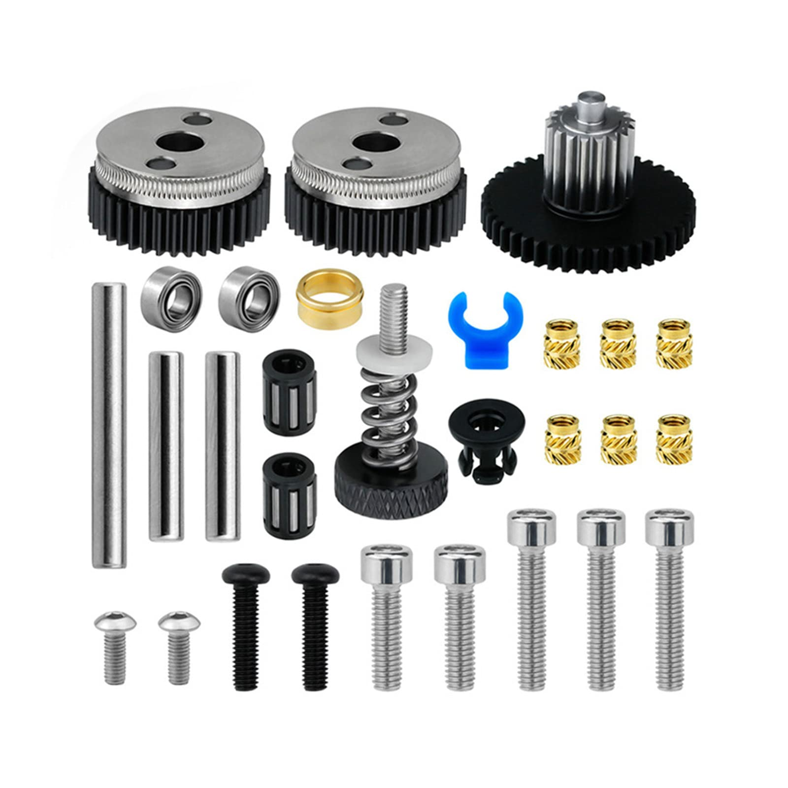
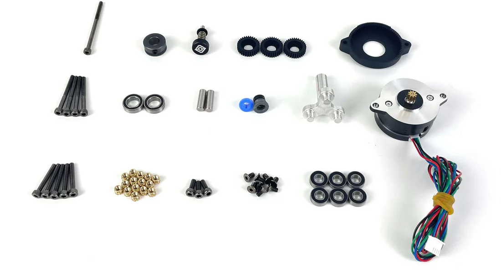

# Awesome-Extruders

A 3D printer extruder is a filament feeding mechanism used in many fused deposition modeling (FDM) 3D printers. 

This is a list of publicaly available extruder designs which can be built using a combination of 3d printed parts and a purchasable gear kit. Sections are broken up by gear type.

Looking for a toolhead to go with your extruder of choice? Check out [Awesome-Toolheads](https://github.com/SartorialGrunt0/Awesome-Toolheads/tree/main).

--------------------

## Table of contents

- [Community Picks](#community-picks)
- [BMG Extruders](#bmg-extruders)
- [HGX-lite Extruders](#hgx-lite-extruders)
- [Galileo 2 Extruders](#galileo-2-extruders)
- [Other Extruders](#other-extruders)
- [Legacy Extruders](#legacy-extruders)

--------------------
### Community Picks
- The Popularity Contest: [Wristwatch](https://github.com/bythorsthunder/Voron_Mods/tree/main/Wristwatch_Extruder_BMG) has taken the community by storm, quickly becoming the most popular standalone extuder. There are remixes for BMG, G2, RIDGA, and IDGA gears, its easy to build, and supports filament cutters and filament sensors for multicolor.
- The Classic: [Sherpa Mini](https://github.com/Annex-Engineering/Sherpa_Mini-Extruder) has been around linger than most of the extruders on the list and for good reason. Its lightweight and to print and assemble. This design inspired nearly every BMG based extruder on the list and has more remixes than any other design to date. She might be showing her age but its still a solid design.
- The Bargain Mart: - [ProtoXtruder](https://github.com/nhchiu/VoronMods/tree/main/Extruders/ProtoXtruder), designed by nhchiu, is part of a family of extuders using the HGX-lite gears. These large gears can be found for $8-15 and include every non-printed part needed. Between the low price, the large gears improving layer consistency, and the extruder using the same mounting pattern as Sherpa-Mini, its a awesome budget extruder.

--------------------
### BMG Extruders

[BMG gears](https://www.bondtech.se/product-category/extruders/bmg-series/?srsltid=AfmBOoqG_gRRpSIDdcMdXtBJIBlN_L-gR9r2ktUPrTVjUjdEChwsAM0k) are part of a kit 
from the popular BMG extruder created by Bondtech. They are available either as a standard kit, where the extruder and drive gear are two seperate pieces, IDGA (Integrated Drive Gear Assembly), where the extruder and drive gear are a single piece, or RIDGA (Reverse IDGA). 
Opt for RIDGA/IDGA, if the extruder supports it, for better layer stacking. 
These gear kits are available from a variety of vendors. Be aware that many vendors sell clones that have varying quality control.

- [Clockwork1](https://github.com/VoronDesign/Voron-Afterburner/releases) - Direct drive extruder for the Voron Afterburner toolhead.
- [Clockwork2](https://github.com/VoronDesign/Voron-Stealthburner) - Direct drive extruder for the Voron Stealthburner toolhead, IDGA supported.
- [Pocket Watch](https://github.com/VoronDesign/Voron-0/tree/Voron0.0/VORON_Pocketwatch) - Bowden extruder for Voron V0.
- [Pocket Watch Nema17](https://mods.vorondesign.com/details/1rw8IyTJO2hoMYllya1IgQ) - Bowden extruder modeled from Clockwork1.
- [Night Watch](https://github.com/VoronDesign/Pocket-Watch/tree/main) - Bowden extruder designed from Clockwork2 for Voron V0.2.
- [Dual Nightwatch](https://github.com/hartk1213/MISC/tree/main/Voron%20Mods/Extruders/Dual_Nightwatch) - Bowden extruder, variant of Night Watch, features dual extruder design.
- [M4 Mobius](https://github.com/VoronDesign/Mobius-Extruder) - Bowden belt driven extruder.
- [Mini14](https://github.com/hartk1213/MISC/tree/main/Voron%20Mods/Extruders/Mini14) - Bowden belt driven extruder, variant of M4, features smaller size and nema14 motor.
- [Wristwatch BMG](https://github.com/bythorsthunder/Voron_Mods/tree/main/Wristwatch_Extruder_BMG) - Direct drive standalone extruder, variant of Wristwatch G2, RIDGA supported.
- [WWBMG IDGA](https://github.com/minilogique/ww-extruder-for-idga) - Direct drive standalone extruder, vsriant of Wristwatch BMG, IDGA supported.
- [Sherpa Mini](https://github.com/Annex-Engineering/Sherpa_Mini-Extruder) - Direct drive standalone extruder, RIDGA supported.
- [Sherpa Micro](https://github.com/Annex-Engineering/Sherpa_Micro-Extruder) - Direct drive standalone extruder, smaller and lighter Sherpa Mini, RIDGA supported.
- [Sherpa Heavy](https://github.com/Annex-Engineering/Sherpa_Heavy-Extruder) - Direct drive standalone extruder, variant of Sherpa Mini, uses a nema17 with pinion gear, RIDGA supported.
- [Sherpa Extra Heavy](https://www.printables.com/model/549890-sherpa-extra-heavy-with-nema17-update-2) - Direct drive standalone extruder, variant of Sherpa Heavy using a standard nema17, RIDGA supported.
- [Sherpa Crew Mini](https://github.com/jrlomas/Sherpa-Crew-Mini) - Direct drive standalone extruder, variant of Sherpa Mini, features two sets of BMG gears. 
- [Sherpa Zero](https://github.com/jrlomas/Sherpa-Zero) - Direct drive standalone extruder, variant of Sherpa Mini, RIDGA supported.
- [Fz](https://github.com/FZaii/FZ-Extruder) - Direct drive standalone extruder, variant of Sherpa Mini.
- [Miro](https://github.com/jrlomas/miro-extruder) - Direct drive standalone extruder, features dual-drive gears.
- [Sailfin](https://github.com/CroXY3D/Sailfin-Extruder) - Direct drive standalone extruder. 
- [Sharkfin](https://github.com/KayosMaker/Sharkfin_Extruder) - Direct drive standalone extruder, variant of Sailfin, RIDGA supported.
- [Sharketype](https://github.com/Armchair-Heavy-Industries/Sharketype) - Direct drive standalone extruder for Archetype toolhead, variant of Sharkfin, RIDGA supported.
- [HextrudORT](https://github.com/MirageC79/HextrudORT) - Direct drive standalone extruder for the HevORT toolhead.
- [Vorxtrudort](https://github.com/nhchiu/VoronMods/tree/main/Extruders/Vorxtrudort) - Direct drive standalone extruder, variant of HextrudORT with mounting for Voron.
- [Vz HextrudORT](https://github.com/VzBoT3D/Vz-HextrudORT) - Direct drive standalone extruder, variant if HextrudORT for VzBot.
- [BoomBox](https://www.printables.com/model/1236812-boombox-the-best-bowden-extruder-on-earth) - Bowden extruder, features dual-gears and dual-motors.
- [RoundHouseBMG](https://github.com/chirpy2605/voron/tree/main/general/RoundHouse) - Direct drive standalone extruder.

--------------------

### HGX-lite Extruders

[HGX-lite gears](https://www.aliexpress.us/item/3256804512828973.html?gatewayAdapt=glo2usa4itemAdapt) are a set of large extruder gears from the HGX-lite extruder believed to be created by Haldis 3D. They also sell the gears standalone as a gear set. These are essentially a clone of the LGX-lite gears. They come in two variants, HGX-Lite and HGX-lite 2.0.  Most extruders featuring these gears are using the original 1.0 version. The 2.0 variant is slightly lighter and can be identified by the extra holes in the drive gears.

- [Hummingbird](https://github.com/nhchiu/VoronMods/tree/main/Extruders/Hummingbird) - Direct drive standalone extruder, features LGX-lite mounting.
- [Large Gear Clockwork2](https://github.com/nhchiu/VoronMods/tree/main/Extruders/Large_Gear_Clockwork2) - Direct drive extruder for the Voron Stealthburner toolhead.
- [ProtoXtruder](https://github.com/nhchiu/VoronMods/tree/main/Extruders/ProtoXtruder) - Direct drive standalone extruder, features Sherpa Mini mounting.
- [ProtoXtruder 2.0](https://github.com/nhchiu/3DPrinter-Designs/tree/main/ProtoXtruder_2.0) - Direct drive standalone extruder, variant of ProtoXtruder for HGX-lite 2.0 gears.
- [Papilio/Papilio Lite](https://github.com/kevinakasam/Papilio-Belt-Extruder) - Direct drive standalone extruder, features using belts rather than gears to push filament.
- [Tsunami](https://www.printables.com/model/1175316-beta-tsunami-extruder) - Direct drive standalone extruder, features dual drive gears.

--------------------

### Galileo 2 Extruders

[Galileo 2 gears](https://github.com/JaredC01/Galileo2) are a set of gears designed by LDO and sold by a number of partners. They are a set of large drive gears in a planetary drive train. This superseded Galileo 1 (also known as Orbiter 1).

- [Galileo 2](https://github.com/JaredC01/Galileo2/tree/main/galileo2_extruder) - Direct drive extruder for the Voron Stealthburner toolhead.
- [Galileo 2 Standalone](https://github.com/JaredC01/Galileo2/tree/main/galileo2_standalone) - Direct drive standalone extruder.
- [Wristwatch G2](https://github.com/tetsu97/WristWatch-G2-Extruder) - Direct drive standalone extruder.
- [Escapement](https://github.com/Armchair-Heavy-Industries/Escapement) - Direct drive standalone extruder.
- [Micro-cosm](https://github.com/Okanoa/micro-cosm) - Direct drive standalone extruder.

--------------------

### Other Extruders

These extruders use a set of gears that are still readily available but are less common.

- [RoundAbout](https://github.com/chirpy2605/voron/tree/main/general/RoundAbout) - Direct drive standalone extruder, features a planetary gearbox.
- [RoundTrip](https://github.com/chirpy2605/voron/tree/main/general/RoundTrip) - Direct drive standalone extruder, features support for multiple gear set types.

--------------------

### Legacy Extruders

Legacy extruders use gear designs that are no longer readily available for purchase or have been superseded by a newer, well adopted design.

- [Orbiter 1(1.5)]( https://www.orbiterprojects.com/orbiter-1-5/) - Direct drive standalone extruder, features a planetary gearbox, superceded by Orbiter 2/2.5.
- [Galileo 1](https://github.com/JaredC01/Galileo) - Direct drive extruder for the Voron Afterburner toolhead, features a planeraty gearbox, superceded by Galileo 2.
- [Stargazer](https://www.printables.com/model/245121-stargazer-v1) - Direct drive standalone extruder, features planetary gearbox. 
- [Double Folded Ascender](https://github.com/Annex-Engineering/Folded_Ascender-Extruder) - Direct drive standalone extruder, features a worm gear design.
- [NF-Cannon](https://github.com/Mellow-3D/NF-Cannon) - Direct drive standalone extruder, features a worm gear design.
- [Lowboi Mk4](https://github.com/Shaunuss/Lowboi-Mk4) - Direct drive standalone extruder, features a worm gear design.
- [Waterwheel](https://github.com/abigexplosion/WATERHWEEL-EXTRUDER/tree/main) - Direct drive standalone extruder, features a worm gear design.
- [Zesty-Nimble V3](https://zestytechnology.readthedocs.io/en/latest/nimble/nimblev3/index.html) - Worm gear extruder.
- [Titania](https://www.printables.com/model/729823-titania-extruder-with-e3d-titan-gears-made-in-sher) - Direct drive standalone extruder, variant of Sherpa Mini, features E3D titan gears.
- [Cyclops](https://github.com/D3vil-Design/Cyclops-Extruder) - Direct drive extruder for the Creality K1 toolhead, superceded by [DXC extruder](https://www.phaetus.com/en-us/products/dxc-extruder).

--------------------

Did I miss something? Open an issue and I'll consider adding it to the list.

